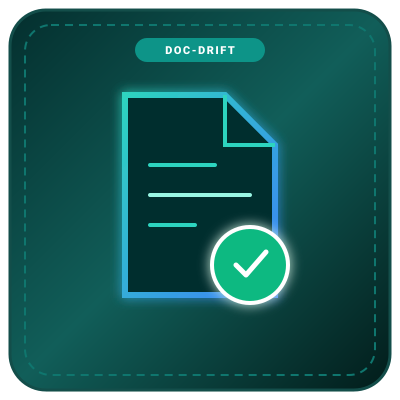

<div align="center">

# doc-drift

**A markdown test runner that verifies your README code snippets actually compile and run.**

<br/>



<br/><br/>

Built by [@MinoForge-Official](https://github.com/MinoForge-Official)

<br/>

[Quickstart](#quickstart) • [Supported Languages](#supported-languages) • [Skipping Snippets](#skipping-snippets) • [GitHub Action](#github-actions-ci) • [Verified Badge](#verified-badge) • [CLI Flags](#cli-options)

<br/>

[](https://www.npmjs.com/package/doc-drift)
[](LICENSE)
[](package.json)
[](README.md)

</div>

---

### What is this?

Many open-source repositories have broken README examples. APIs change during refactors, packages get renamed, but maintainers forget to update code snippets in their documentation. New users clone the project, copy the quickstart snippet, and hit `Cannot find module` or syntax errors within 30 seconds.

`doc-drift` extracts all fenced code blocks from your markdown files (`README.md`, `docs/**/*.md`), validates their syntax, checks that imported packages exist in your `package.json`, and reports any broken snippets.

It has **zero external runtime dependencies**, runs in **under 60ms**, and can award your project an official `[docs: verified]` status badge.

---

### Table of Contents

1. [Quickstart](#quickstart)
2. [Example Output](#example-output)
3. [Supported Languages](#supported-languages)
4. [Skipping Snippets](#skipping-snippets)
5. [GitHub Actions CI](#github-actions-ci)
6. [Verified Badge](#verified-badge)
7. [CLI Options](#cli-options)
8. [Programmatic API](#programmatic-api)
9. [License](#license)

---

### Quickstart

Run it directly with `npx`:

```bash
# Test README.md and all markdown files in ./docs
npx doc-drift

# Test and generate a local SVG status badge
npx doc-drift --badge

# Strict mode for CI (fails if any snippet fails)
npx doc-drift --strict
```

Or install it globally:

```bash
npm install -g doc-drift
```

---

### Example Output

```text
  Scanned: 2 markdown files (5 codeblocks found)

  ✔ README.md:14-22 [typescript] (4ms)
  ✔ README.md:28-35 [json] (1ms)
  ✖ README.md:42-48 [javascript]
     ERROR Broken import: package "old-helper" is used in README example but not installed in package.json
     Users copying this example will encounter "Cannot find module 'old-helper'"

  ─────────────────────────────────────────────────────────────────
  Results: 2 passed, 1 failed, 0 skipped

  DOCS OUT OF DATE  Some code snippets contain broken imports or syntax errors.
```

---

### Supported Languages

| Language | Exts | What gets validated |
| :--- | :---: | :--- |
| **TypeScript / JavaScript** | `ts`, `tsx`, `js`, `jsx` | Syntax check + verifies that imported packages exist in `package.json` or Node built-in modules. |
| **JSON** | `json` | Strict JSON formatting and parsing. |
| **Bash / Shell** | `bash`, `sh`, `shell` | Unmatched quotes, backticks, and shell command structure. |
| **Python** | `py`, `python` | Bracket, parenthesis balancing and basic syntax structure. |

---

### Skipping Snippets

If you have pseudo-code or an illustrative snippet that shouldn't be validated, add `skip` to the language tag:

````markdown
```ts skip
// Pseudo-code snippet
app.doSomethingMagical();
```
````

Or add an HTML comment directly above the codeblock:

````markdown
<!-- doc-drift:skip -->
```js
fakeExample();
```
````

---

### GitHub Actions CI

To run `doc-drift` on every pull request, add `.github/workflows/docs.yml`:

```yaml
name: Docs Check

on: [push, pull_request]

jobs:
  verify-documentation:
    runs-on: ubuntu-latest
    steps:
      - uses: actions/checkout@v4
      - uses: actions/setup-node@v4
        with:
          node-version: 22
      - run: npm ci
      - uses: MinoForge-Official/doc-drift@main
```

---

### Verified Badge

Show visitors that your README code examples are tested and up to date:

```markdown
[](https://github.com/MinoForge-Official/doc-drift)
```

---

### CLI Options

```text
Usage: doc-drift [paths...] [options]

Arguments:
  [paths...]            Target markdown files or directories (default: README.md, docs)

Options:
  --badge               Generate a docs-verified.svg status badge
  --badge-path <path>   Custom output path for the SVG badge
  --strict              Exit with code 1 if any snippet fails
  --json                Output scan results in JSON format
  -h, --help            Show help documentation
  -v, --version         Show version
```

---

### Programmatic API

```typescript
import { runDocDrift } from 'doc-drift';

const report = runDocDrift({ targetPaths: ['README.md'] });
console.log(`Passed: ${report.passedBlocks}/${report.totalBlocks}`);
```

---

### License & Legal Policy

[Custom Non-Commercial & Source-Available License](LICENSE) • [Legal Notice & Anti-Piracy Terms](LEGAL.md)  
© 2026 MinoForge-Official. All rights reserved. Unauthorized selling, re-uploading, mirroring, and impersonation are strictly prohibited and actively tracked.
